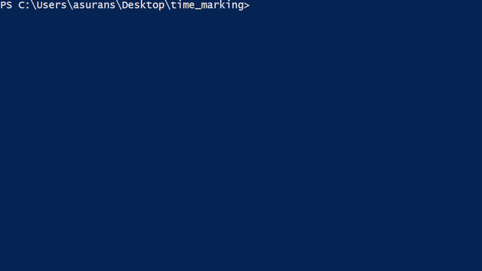

# Personal Timekeeper

This is a personal timekeeper utility that saves data to a CSV file.

The usage is self explanatory and shown below:

The utility updates the CSV file every 5 seconds in case there is some kind of corruption.